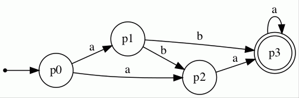
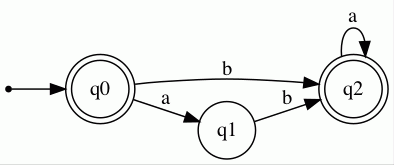
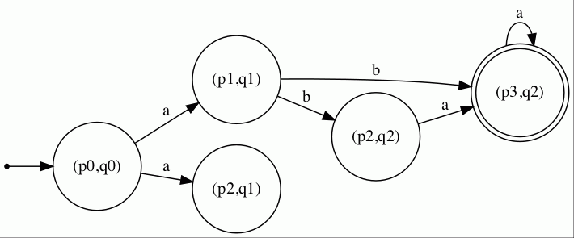
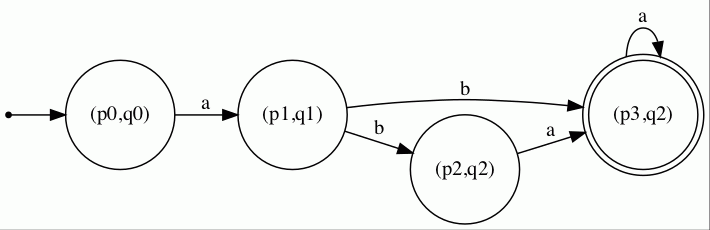
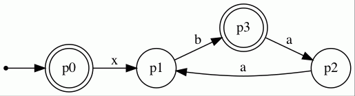
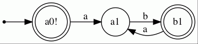

<h1>
  Lifa - A simple library for finite automata
</h1>

If you are looking for an intuitive implementation of finite automata in Java without much squiggle, Lifa is your friend (;
It features a graphical output of automata via [GraphViz](https://graphviz.org/) and an [ANTLR](https://www.antlr.org/) parser that creates automata from files as well as a selection of classical automata constructions such as intersection, determinization, Kleene star. 
Basic language checking algorithms like emptiness or universality are also available.

<h2>
  Compile and run
</h2>

Step1: After having downloaded the repository, you need to [install](https://graphviz.org/download/) GraphViz.
On Mac, an installation via Homebrew is simple:
```
brew install graphviz
```

Step2: In your IDE, make sure that you use the correct run configuration to compile and run a Maven project.
As goals of the run configuration, you should set:
```
compile exec:java -Dexec.mainClass="main"
```

Step3 (optional): If you are using Eclipse with embedded Maven, you may run into an infamous [bug](https://bugs.eclipse.org/bugs/show_bug.cgi?id=506676).
There are two solutions to the problem, the [easier one](https://stackoverflow.com/questions/63518376/eclipse-maven-slf4j-class-path-contains-multiple-slf4j-bindings) and the [more involved one](https://stackoverflow.com/questions/63755390/multiple-slf4j-bindings-with-m2e-in-eclipse-2020-06).
After this, you are ready to go (:

<h2>
  Construction of a simple automaton
</h2>

To construct a finite automton (NFA), we first need to construct the letters of the underlying alphabet.
In the following example, the alphabet will consist of the letters 'a' and 'b'.
```
Letter a = new Letter("a");
Letter b = new Letter("b");
```

Now we construct the set of states 'p0', 'p1', 'p2', and 'p3'.
```
State p0 = new State("p0");
State p1 = new State("p1");
State p2 = new State("p2");
State p3 = new State("p3");
```

An NFA consists of transitions.
A transition requires a source state, a target state, and a label.
The construction is simple:
```
Transition t1 = new Transition(p0,p1,a);
Transition t2 = new Transition(p1,p2,b);
Transition t3 = new Transition(p2,p3,a);
Transition t4 = new Transition(p3,p0,b);
```

It is left to glue the transitions together to an NFA 'A'.
```
Autom A = new Autom();
A.addTransition(t1);
A.addTransition(t2);
A.addTransition(t3);
A.addTransition(t4);
```

Now we can specify the initial and the final states of the automaton.
```
A.addFinal(p0);
A.addFinal(p2);
A.setInit(p0);
```

Hence, 'p0' is both - initial and final, 'p1' and 'p3' are neither, 'p2' is only final but not initial.

<h2>
  Graphical Output
</h2>

Lifa translates the automaton into the language DOT and calls GraphViz.
The corresponding output can then be generated by:
```
AutomPrinter.createVisual(A, "exampleRM");
```

Note that the standard file format is .gif.
The command generates a file 'exampleRM.gif' with the desired graphical output:


<h2>
  Automata Constructions
</h2>

Lifa features the standard automata constructions: Intersection (Product), Union, Concatenation, Kleene star, Determinization (Powerset), Complement, Reversal, and Reduction.
We consider the constructions with two examples that we load from the example collection:
```
Autom A = ExampleCollection.exampleRM_A();
Autom B = ExampleCollection.exampleRM_B();
```

Automaton 'A' is given as below:



Automaton 'B' is given by:



<h3>
  Intersection
</h3>

Lifa can compute the product of 'A' and 'B' - the NFA that accepts the intersection of the languages L(A) and L(B).
We can call the corresponding method from the Operations class:
```
Autom C = Operations.intersect(A,B);
```

The product 'C' is then given by:



<h3>
  Reduction
</h3>

As we can see in the picture, not all states of the automaton 'C' are useful.
In fact, from the state '(p2,q1)', we cannot reach a final state and therefore it does not contribute to the language of the automaton.
To get rid of such states and to shrink the size of the automaton without changing its language, we perform a reduction:
```
Autom Rev = Operations.reduce(C);
```

The method eliminates the useless states and for the above example, we obtain:



<h3>
  More Operations
</h3>

Similarly to intersection and reduction, other operations on automata can be called from the Operations class:
```
C = Operations.union(A,B);
C = Operations.concat(A,B);
C = Operations.kleene(A);
C = Operations.determinize(A);
C = Operations.complement(A);
C = Operations.reverse(A);
```

The corresponding results can be considered in the attached gif files of this repository.

<h2>
  Language Algorithms
</h2>

Lifa features basic language testing algorithms.
These can be called from the Language class.
Assume we have two automata 'A' and 'B'.
Then the following algorithms are available:
```
Language.isEmpty(A);
Language.isUniversal(A);
Language.isContained(A,B);
Language.isEquivalent(A,B);
```

<h2>
  Parse Automata
</h2>

Lifa contains a parser for finite automata generated by ANTLR.
To call the parser on a file or string, we can simply call the corresponding method from the class 'AutomParser'.
Here, we parse an NFA from the file 'parsetest.txt'.
```
Autom A = AutomParser.parseFromFile("src/examples/parsetest.txt");
```

The file 'parsetest.txt' contains the following:
```
trans
[p0](x)[p1],
[p1] (b)[p3],
[p3](a) [p2],
[p2](a) [p1];

init
[p0];

final
[p0],
[p3];
```

So in order to parse an NFA, we need to stick to the format.
First, we specify the transitions via the keyword 'trans'.
A transition is always written as
```
[source](label)[target]
```

Note that the brackets are mandatory!
Several transitions have to be separated by a comma.
After the last transition, a semicolon is required.
Spaces and line breaks are generally ignored.

Then, we specify the initial state via the keyword 'init'.
The form that we need to maintain is:
```
[initial];
```

Last, we add the final states.
Several final states are separated by a comma, after the last one, we need a semicolon.

The corresponding NFA looks as follows:



For more information on the input format that our parser can handle, we refer to the grammar that describes the format.
It is the file 'Automaton.g4' that is located in the folder 'src/automatonParser'.

<h2>
  Regular Expressions
</h2>

Lifa can handle regular expressions and operate on them.
Regular expressions are either atoms (letters), epsilon (the empty word), or the empty set (zero).
Moreover, they can be build with operations of the Kleene algebra - concatenation (.), Kleene star (\*), and union (+) - out of other regular expressions.
When constructing a regular expression in Lifa, we start by creating the required atoms via the corresponding constructor. 
Then, we employ the required operations via the class 'Kleene'.
In the following, we give an example:
```
Atom a = new Atom("a");
Atom b = new Atom("b");
RegExp ab = Kleene.concat(a,b);
RegExp abstar = Kleene.star(ab);
RegExp abstar_eps = Kleene.add(abstar,Epsilon.getEps());
System.out.println(abstar_eps.toString());
```

The last line of code prints the regular expression: it is (a.b)* .
Note that this may be unexpected since we effectively construct (a.b)* + eps.
However, epsilon is not needed since it is already included in (a.b)* and Lifa simplifies the expression accordingly.
Internally, Lifa simplifies some more cases and tries to construct a simple regular expression.

Note that espilon and zero do not have classical constructors like atoms do, but we can access them by using
```
Epsilon.getEps();
EmptyExp.getEmptySet();
```

<h2>
  Translating Automata into Regular Expressions and vice versa
</h2>

Lifa features algorithms for turning regular expressions into automata and automata into regular expressions.
To apply the former one, we take a regular expression and call the method 'toAutom()'.
We showcase the method with the above example:
```
Autom A = abstar.toAutom();
```

The automaton that Lifa creates accepts the language (a.b)* and looks as follows:



For turning an automaton into a regular expression, Lifa applies [Brzozowski's method](https://michaellevet.wordpress.com/2015/04/22/automata-theory-brzozowski-algebraic-method/).
It takes an automaton and translates it into a linear equation system over regular expressions.
The equation system is then solved by applying Arden's Lemma and Gaussian elimination.
To call it in Lifa, we first create a linear equation system and then call a method that solves it.
We apply it to the above automaton A:
```
RegSystem ALEQ = new RegSystem(A);
RegExp abstar_brz = ALEQ.solve();
System.out.println(abstar_brz.toString());
```

The last line of code prints the expression (a.b)* which is what we were expecting.
Note that Lifa tries to simplify intermediate regular expressions.
Nevertheless, they can get larger than calculating them by hand.
