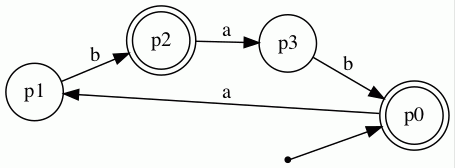

<h1>
  Lifa - A simple library for finite automata
</h1>

If you are looking for an intuitive implementation of finite automata in Java without much squiggle, Lifa is your friend (;
Currently, it features a graphical output of automata via [GraphViz](https://graphviz.org/).
In the future, classic automata algorithms will be added.

<h2>
  Construction of a simple automaton
</h2>

To construct a finite automton (NFA), you first need to construct the letters of the underlying alphabet.
In the following example, the alphabet will consist of the letters 'a' and 'b'.
```
Letter a = new Letter("a");
Letter b = new Letter("b");
```

Now you need to construct the set of states.
We construct the states 'p0', 'p1', 'p2', and 'p3'.
```
State p0 = new State("p0");
State p1 = new State("p1");
State p2 = new State("p2");
State p3 = new State("p3");
```

Now we construct the transitions.
A transition requires a source state, a target state, and a label.
The construction is simple:
```
Transition t1 = new Transition(p0,p1,a);
Transition t2 = new Transition(p1,p2,b);
Transition t3 = new Transition(p2,p3,a);
Transition t4 = new Transition(p3,p0,b);
```

It is only left to glue everything together to an NFA 'A'.
We add the letters, the states, and the transitions to 'A'.
```
Autom A = new Autom();

A.addLetter(a);
A.addLetter(b);

A.addState(p0);
A.addState(p1);
A.addState(p2);
A.addState(p3);

A.addTransition(t1);
A.addTransition(t2);
A.addTransition(t3);
A.addTransition(t4);
```

Now we specify the initial and the final states of 'A'.
```
A.addFinal(p0);
A.addFinal(p2);
A.setInit(p0);
```

Hence, 'p0' is both - initial and final, 'p1' and 'p3' are neither, 'p2' is only final but not initial.

<h2>
  Graphical Output
</h2>

First, you need to be sure that GraphViz is [installed](https://graphviz.org/download/).
On Mac, we recommend an installation via Homebrew:
```
brew install graphviz
```

Lifa translates the automaton into the language DOT and calls GraphViz.
The corresponding output can then be generated by:
```
AutomTranslator.createVisual(A, "exampleRM");
```

Note that the standard file format is .gif.
The command generates a file 'exampleRM.gif' with the desired graphical output:



<h2>
  Automaton Algorithms  
</h2>
More on this in future updates (:
